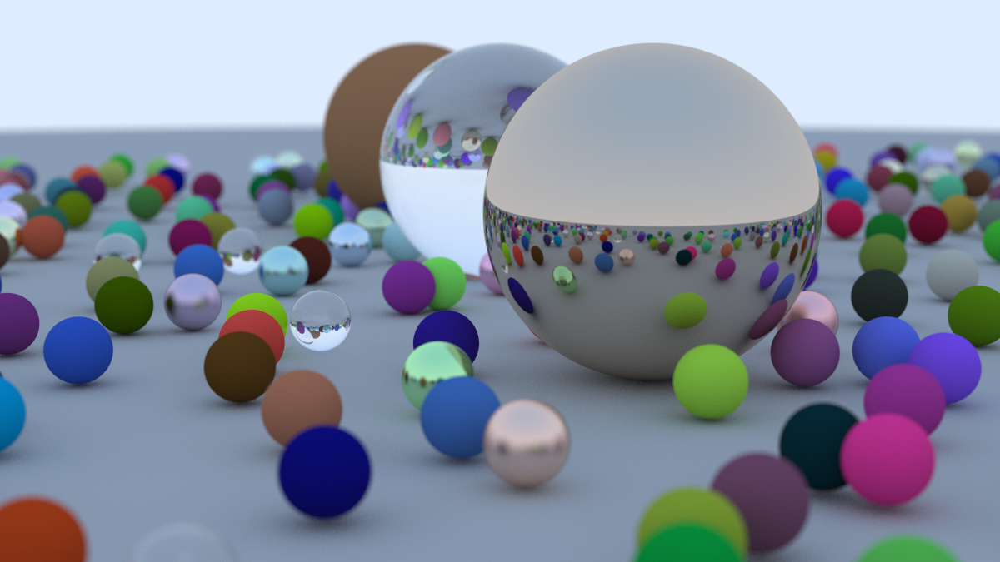

# Ray Tracing in One Weekend



Based on the [book](https://raytracing.github.io/books/RayTracingInOneWeekend.html) by Peter Shirley.

# Requirements
- A working Rust installation, we recommend using [rustup](https://rustup.rs/).

# Quickstart
```console
cargo run > image.ppm
```
